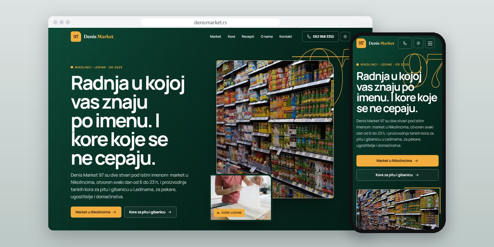
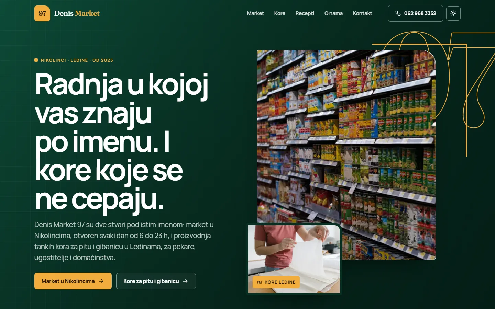
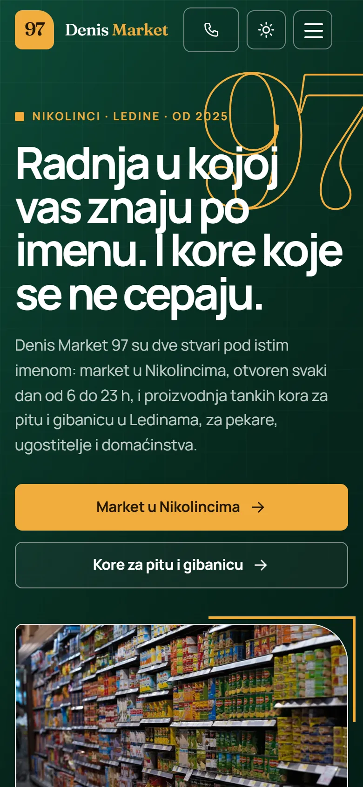
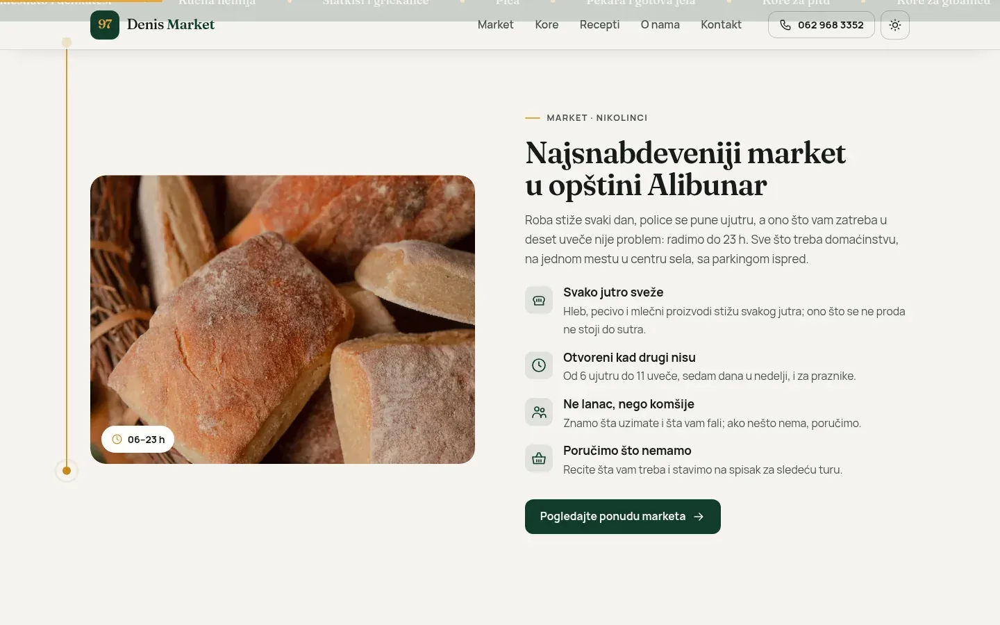
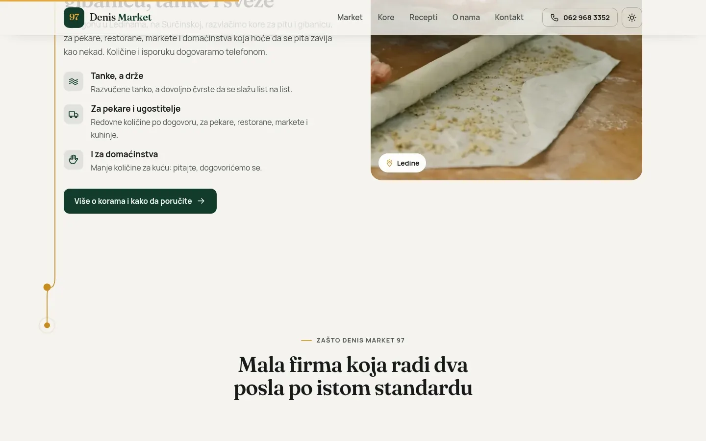

# Denis Market 97

One 37-page site for two businesses under one name: a village grocery store in Nikolinci and a filo pastry workshop in Belgrade.

**[denismarket.rs](https://denismarket.rs/)** · [Case study (in Serbian)](https://svilenkovic.com/radovi/denis-market-97) · [Srpski](README.sr.md)

> [!NOTE]
> Client project. The source code belongs to the client and stays in a private repository. This page describes what I built and how.

<table>
  <tr><td><b>Client</b></td><td>Denis Market 97</td></tr>
  <tr><td><b>Industry</b></td><td>Village grocery store and filo pastry production</td></tr>
  <tr><td><b>Location</b></td><td>Nikolinci and Belgrade, Serbia</td></tr>
  <tr><td><b>Type</b></td><td>Multi-page website</td></tr>
  <tr><td><b>My role</b></td><td>Design, development, SEO, hosting and maintenance</td></tr>
  <tr><td><b>Stack</b></td><td>PHP 8.3, custom router, flat-file content, JSON-LD</td></tr>
</table>

## About the project

Denis Market 97 runs a grocery store in Nikolinci, a village in the Alibunar municipality, and keeps it open every day from 6 am to 11 pm. In Ledine, Belgrade, the same company makes thin filo sheets that bakeries, restaurants and households use for pies. One person answers the phone for both. The site had to send a neighbour to the shop and a bakery to the pastry workshop, without either of them landing on the other's pages.

I kept one brand with two separate branches: everything about the shop lives under /market/, everything about the pastry under /kore/, and only contact, about, locations and the FAQ are shared. There are no prices and no cart, because shelf prices change faster than any website and pastry prices depend on volume. Distances to nearby places were measured along the road, the way people actually drive. Of the eight town pages the client asked for I built three, since the rest would have been near-copies with nothing true to say.

## What I built

- 37 pages in five branches, with content kept in plain PHP data files and no database or CMS
- Six recipes with Recipe markup, a way in for people who bake with ready-made filo and are not yet looking for a supplier
- A sitemap built from the same data as the pages, so a new page cannot be left out of it
- Opening hours for all seven days in structured data, with the pastry workshop linked to the company as a department
- One contact form for both branches, with a topic selector, spam scoring and a log of every message, rejected ones included
- Day and night themes and self-hosted fonts preloaded in both Latin subsets, so č, ć, š, ž and đ do not reflow the text

## Results

| | Performance | Accessibility | Best practices | SEO |
| :-- | :-: | :-: | :-: | :-: |
| Mobile | 85 | 100 | 100 | 100 |
| Desktop | 97 | 100 | 100 | 100 |

PageSpeed Insights, lab test of the live site, September 2026. Security headers: 6 of 6. HTML validator: no errors. axe accessibility check: no violations. Structured data: `FAQPage`, `GroceryStore`, `LocalBusiness`, `Person`.

## Screenshots

<table>
  <tr>
    <td width="68%" valign="top"></td>
    <td width="32%" valign="top"></td>
  </tr>
</table>

The market: fresh every morning, open from 6:00 to 23:00, seven days a week

Phyllo sheets from Ledine: for bakeries and restaurants by arrangement, for households on request

---

Built by [D. Svilenković](https://svilenkovic.com).
